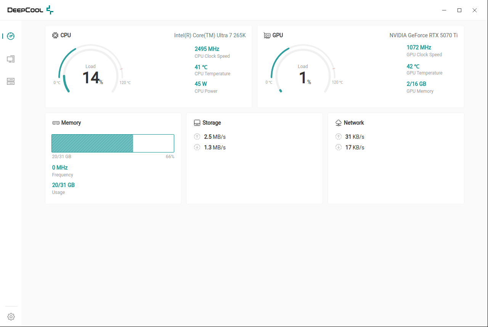
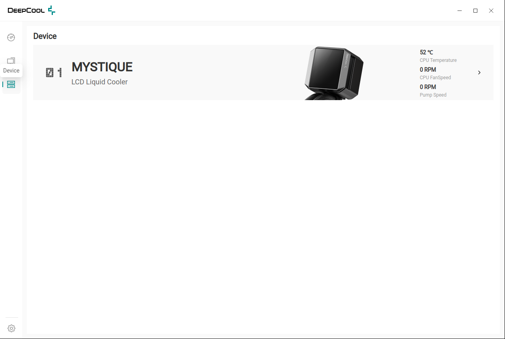
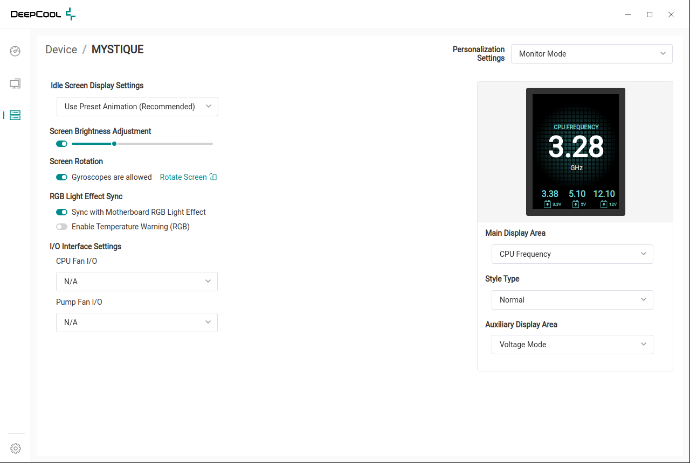
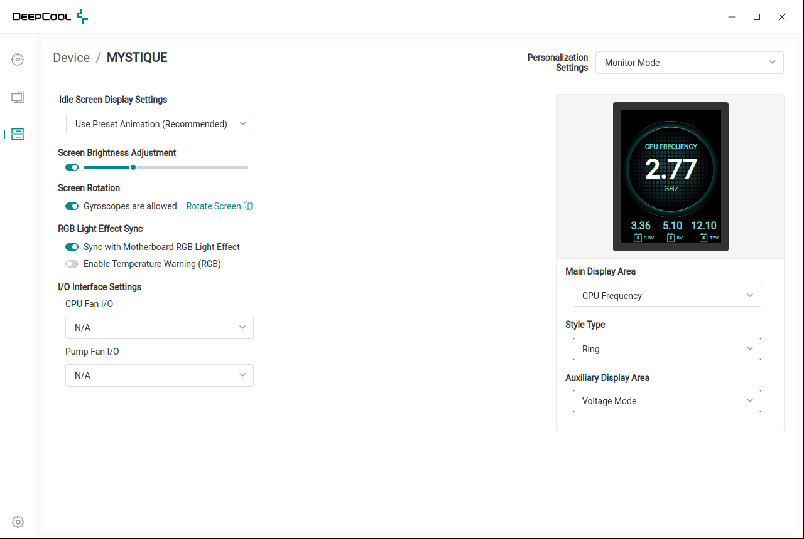
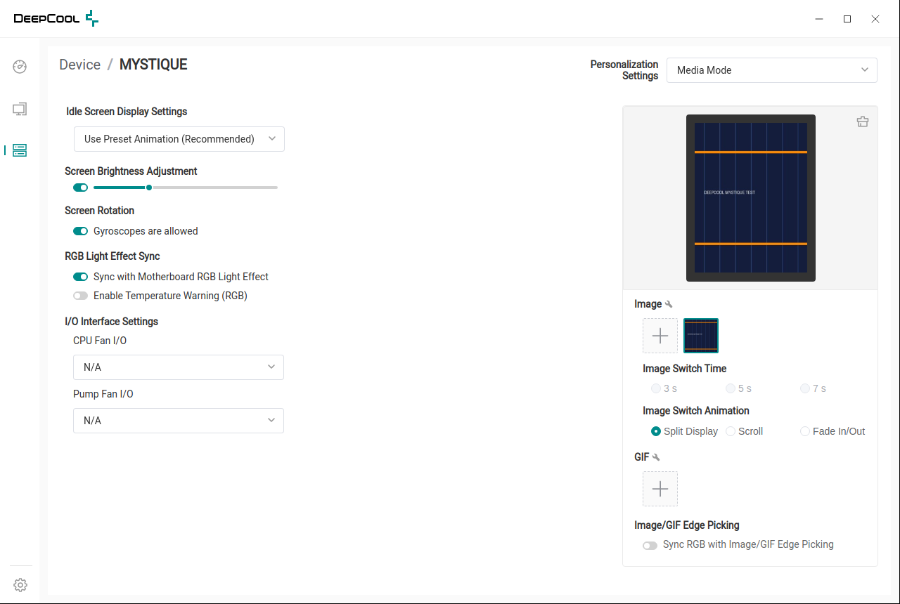
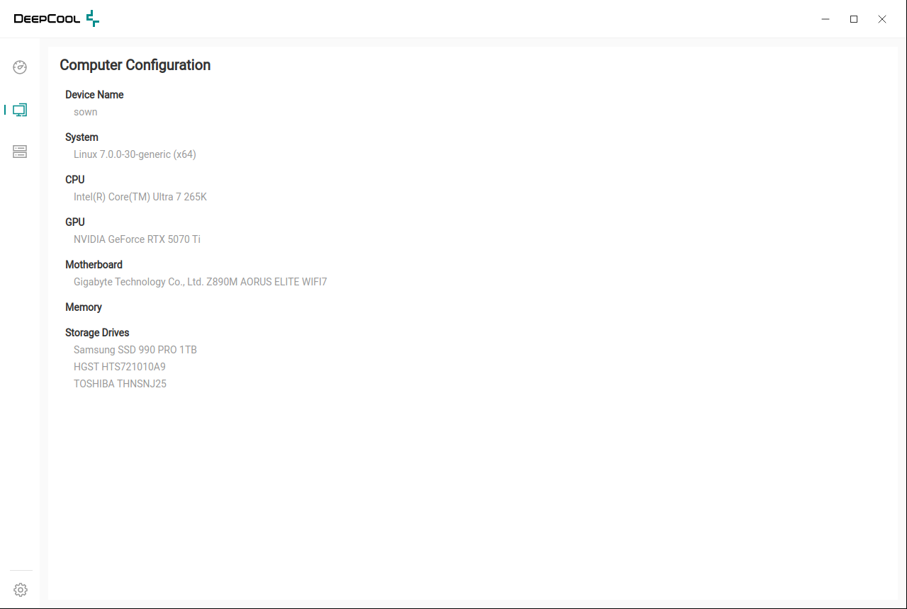

# mystiquectl

Control a DeepCool MYSTIQUE 360 AIO cooler on Linux, by running DeepCool's own
official Electron app natively against a USB shim instead of a stub or a VM.

[](LICENSE)
[](#requirements)
[](#disclaimer)

## What is this

DeepCool ships a Windows-only Electron app to drive the MYSTIQUE 360's LCD
panel — sensor dashboard, image/GIF upload, animated layouts. There is no
Linux build, and the existing community Linux tools for this cooler cover
basic sensor display but not the app's richer features (media upload, custom
layouts, animation), because that logic lives in the app's own protocol code,
compiled to V8 bytecode.

**mystiquectl** takes a different approach from reimplementing that protocol
from scratch: it runs DeepCool's *own* app.asar, unmodified except for a thin
recording/replay shim over its `usb` module, on the same exact Electron build
(23.3.13) it ships with. Because it's the same V8 and the same bytecode, the
app's real main process — including everything Windows-only that has no Linux
equivalent — runs natively on Linux. Everything that *is* Windows-only (a .NET
sensor bridge, a Skia canvas, native protocol modules, named-pipe services)
gets replaced by small Linux-native reimplementations so those parts of the
app behave the same on Linux as they do on Windows, backed by real sensor
data instead of stubs.

The same harness that makes this possible for day-to-day use was built as a
**protocol capture and reverse-engineering tool**: run the app against a
synthetic fake device, record every byte in both directions, and read the
frame grammar and command set back out of the wire trace and the app's own
error messages. That capture methodology, and everything it recovered, is
documented in the [Protocol](#protocol--technical-deep-dive) section below.

## Disclaimer

> **mystiquectl is an independent, community project. It is not affiliated
> with, endorsed by, or supported by DeepCool in any way.** "DeepCool" and
> "MYSTIQUE" are trademarks of their respective owner and are used here only
> to identify the hardware this project controls (nominative use).
>
> This repository ships **no DeepCool code**. It contains only original
> glue/shim code written for this project. To use it you must supply your
> own copy of `app.asar`, extracted from DeepCool's own official Windows
> installer that you download yourself — see [Installation](#installation).

## Features

- **Full sensor dashboard on Linux** — CPU clock/load/temperature/power
  (RAPL), memory, disk and network rates, hwmon fans and drive temperatures,
  GPU stats via `nvidia-smi`, and real DMI/SMBIOS machine info, all fed to
  the app's own dashboard and Computer Configuration page in place of the
  Windows-only services that would normally supply them.
- **Working fan/pump RPM readout in the app's own Device card** — fixes an
  app-side rendering bug (raw `{Name, Value, Unit}` objects reaching a
  renderer that expects a bare number) that otherwise makes real tachometer
  data show up as literal overflowing JSON text.
- **Image and GIF upload**, including the crop dialog, transmitted to the
  device in DeepCool's own `DCLd`-record transfer format.
- **Display layout customization** — style (Normal / Ring / Stopwatch),
  animation (Split Display / Scroll / Fade In/Out), auxiliary display modes,
  brightness, temperature warnings — driven through the app's real UI or
  headlessly over IPC.
- **A protocol capture harness** for reverse-engineering: a synthetic
  fake MYSTIQUE device, configurable reply modes, full bidirectional frame
  logging, and headless IPC drivers for exercising every app feature without
  clicking through the UI.
- **A real-hardware bridge** (`impl/usb-bridge.py`) that forwards the app's
  traffic to an actual MYSTIQUE over USB, with guards against the app's own
  destructive-by-default behavior (see
  [Talking to the real cooler](#talking-to-the-real-cooler)).
- **One System Monitor value replaceable with anything you want** — a
  smooth, no-flicker way to put a number on the panel the app was never
  built to show (see
  [Putting a custom number on the panel](#putting-a-custom-number-on-the-panel)).

## Screenshots

All of these are DeepCool's own official app UI, running unmodified on
Linux through this project's shim — nothing here is a custom interface.

<table>
<tr>
<td width="50%">

**Dashboard** — live CPU/GPU/memory/storage/network, sourced from real Linux
sensors (RAPL, hwmon, `nvidia-smi`, `/proc`) instead of the Windows-only
services the app expects.



</td>
<td width="50%">

**Device card** — genuine tachometer numbers (`0 RPM` at rest here, real
RPM once a fan I/O interface is picked), not the raw
`{"Name":"SYS_FAN1","Value":0,"Unit":"RPM"}` text this used to render before
the [fan-list shape fix](#the-lcds-fanpump-rpm-slots).



</td>
</tr>
<tr>
<td width="50%">

**MYSTIQUE settings** — Idle Screen, Brightness, Rotation, RGB Sync and I/O
Interface controls alongside a live LCD preview that mirrors the real panel.



</td>
<td width="50%">

**Display layout customization** — Style Type set to *Ring*, Auxiliary
Display Area to *Voltage Mode*; the preview updates live as each control
changes, matching the exact bytes sent on the wire.



</td>
</tr>
<tr>
<td width="50%">

**Media Mode** — a real image uploaded through the app's own crop dialog
(`testmedia/test.jpg`), now showing on the LCD preview and selected as the
active thumbnail.



</td>
<td width="50%">

**Computer Configuration** — real CPU, GPU, motherboard and disk identity,
via `impl/sysinfo.js` and the DMI cache in place of the Windows-only system
info service.



</td>
</tr>
</table>

## Requirements

- Linux, `x86_64` or `aarch64`. `install.sh` and `run-only.sh` detect your
  CPU architecture (`uname -m`) and fetch the matching official Electron
  build; any other architecture needs a manually-supplied Electron build
  via `DC_ELECTRON_DIR`. In practice the MYSTIQUE is a desktop CPU AIO
  cooler, so `x86_64` is what almost everyone needs — `aarch64` support
  exists mainly so the tool isn't silently wrong if you run it there.
- `python3`, and the `python3-usb` distro package (pyusb + a libusb1
  backend) — only needed to talk to a **real** cooler via
  `impl/usb-bridge.py`. The synthetic-device capture/test path needs no USB
  library at all.
- **No Node.js/npm.** Every `.js` file under `impl/`, `shim/`, `driver/` uses
  only Node built-ins (`fs`, `path`, `net`, `os`, `child_process`, `events`,
  `crypto`, `module`) bundled inside the vendored Electron binary itself.
  There is no `package.json` and no `node_modules`.
- Electron **v23.3.13 exactly**, pinned to match the app's own
  bytenode/V8 build. `install.sh` fetches it for you from Electron's own
  official GitHub release — see [Installation](#installation).
- `usbutils` (for `lsusb`), used by `run-real.sh` to sanity-check the device
  is on the bus before starting.
- `xdotool` and ImageMagick's `import` — only needed for the optional
  `ui-tour.sh` / `ui-tour-real.sh` scripted-demo-driving scripts, not for
  normal day-to-day use against a real cooler via `run-real.sh`.
- Your own extracted copy of DeepCool's `app.asar` (see below). This
  repository does not, and will never, include it.

## Installation

```sh
curl -fsSL https://raw.githubusercontent.com/sowndev0106/mystiquectl/main/install.sh | bash
```

or clone and run it yourself:

```sh
git clone https://github.com/sowndev0106/mystiquectl.git
cd mystiquectl
./install.sh
```

`install.sh` fetches the pinned Electron 23.3.13 Linux build straight from
[Electron's own GitHub releases](https://github.com/electron/electron/releases/download/v23.3.13/electron-v23.3.13-linux-x64.zip)
(MIT-licensed, an official redistribution channel) into `.electron/` — it is
never committed to this repo. Run `./install.sh update` later to refresh it.

### Getting `app.asar`

You need DeepCool's own app for the MYSTIQUE, extracted from their **official
Windows installer**, which you download yourself from DeepCool. In short:

1. Download and run DeepCool's MYSTIQUE control-software installer on Windows
   (or unpack it without installing, e.g. with 7-Zip).
2. Locate the installed app's `resources/app.asar` file.
3. Copy that one file to your Linux machine.

No further unpacking is required — `shim.py` reads and repacks the `.asar`
archive directly (see [asar.py](asar.py)). Point the tool at your copy either
by placing it where `shim.py`/`run.sh` expect it, or via whatever path
argument or environment variable your `install.sh` setup prompts for.

This is a one-time, local, non-redistributive step: the file never leaves
your machine and is never fetched or hosted by this project.

## Usage

```sh
./shim.py install      # back up app.asar, inject the recording shim
./run.sh 45            # run the app on Linux Electron for 45s, then analyse
./ui-tour.sh "devices:28,214 mystique:660,185"   # …or drive the real UI
./shim.py uninstall    # restore the pristine app.asar
```

`./shim.py status` reports what is installed and how big the current capture
is.

To run the app against your **real** cooler instead of the synthetic fake
(see [Talking to the real cooler](#talking-to-the-real-cooler)):

```sh
./run-real.sh 90          # headless, against the hardware
DC_UI=1 ./run-real.sh     # on your desktop, until you close it
```

To just see the app's own window, with live sensors and media upload, on
your desktop:

```sh
DC_PIDS=0x0009 ./run-ui.sh 60                       # window on a headless X, screenshots
DC_PIDS=0x0009 ./ui-tour.sh "devices:28,214 mystique:660,185 dd:1097,99"
./tour-frames.py                                    # which frames each click produced
```

### Environment variables

| Variable | Default | Meaning |
|---|---|---|
| `DC_PIDS` | all 8 known DeepCool PIDs | Which product ids the fake device advertises |
| `DC_STUB` | see `run.sh` | Substrings of native modules to replace with recording stubs; `none` loads everything |
| `DC_CAPTURE_DIR` | `./capture` | Where the log, blobs and `replies.json` live |
| `DC_TRACE_DEVICE` | unset | `1` logs every property the app reads off the device — how the `.device` requirement was found |
| `DC_QUIET` | canvas calls | Regex of stub paths to summarise instead of logging; `none` logs everything |
| `DC_INLINE_MAX` | 512 | Buffers larger than this go to `capture/blobs/` instead of inline hex |
| `DC_FAN_IO` | unset | `"<cpu>,<pump>"` — pins the MYSTIQUE fan/pump I/O choice the app cannot keep on its own |

Real-hardware and UI-tour variables are documented further down, next to the
features they control: [real-cooler variables](#talking-to-the-real-cooler),
[UI-tour variables](#running-the-ui).

### Reply modes

How the (synthetic) device answers is `capture/replies.json`, seeded from
`defaults-replies.json` on first run. Three modes:

```json
{ "auto":    { "uuid": "PF2M4K7X9Q1B", "size": 64 } }   // default: reply to whatever was asked
{ "in":      { "1": "aa2e12...", "2": "..." } }         // fixed bytes per endpoint
{ "sweep":   ["aa3e12...", "aa3e12..."] }               // a different candidate per read
```

`auto` builds a well-formed reply for the command just received and is what
gets the device to `ok`. `in` pins one answer, `sweep` is what `sweep.py`
uses to search. Adjust, re-run, see how much further the app gets.

### Driving the app headlessly

The shim runs inside the main process, which is where the app registers its
`ipcMain` handlers — so any application command can be invoked directly, with
no renderer and no clicking. Point `DC_DRIVER` at a CommonJS module exporting
`async (api) => {}`; it receives `{ invoke, log, ipcMain, channels }`.

```sh
DC_DRIVER=$PWD/driver/full-flow.js ./run-only.sh 125 && ./map.py
```

| driver | what it does |
|---|---|
| `driver/probe.js` | read-only: device list, settings, resources |
| `driver/sweep-settings.js` | one field at a time through every setting |
| `driver/upload-media.js` | uploads `testmedia/test.jpg` and `test.gif`, then selects them |
| `driver/full-flow.js` | both of the above, end to end |

`map.py` attributes each captured frame to the `sweep.set` marker before it
and prints the field ↔ command table.

### Checking it still works

`./e2e.py` runs the whole thing and asserts on what comes out — 73 checks
over nine phases, a bit over five minutes with real hardware attached
(`--no-hw` skips the last phase and needs none):

```
preflight   8   shim installed, electron present, every impl module loads,
                no third-party deepcool daemon holding the device
clean       1   config backed up (to a location a reboot won't erase) and cleared
flow        6   100+ IPC calls actually succeeded (not just attempted), no
                unhandled JS error anywhere in the run, flow reached the end
proto       9   frame checksums, both interfaces on their own endpoints,
                0x12 then 0x14 leading the session, the brightness byte
                against the documented re-encoding formula
sensor      9   push started, system info non-null, gpuInfo a list, the
                DMI-cache memory clock is actually half the DIMM rating
                (not just nonzero), the SuperIO rails when one is bound
media       7   DCLd records reassembled from the transfer stream, decoded
                back to complete 480x640 JPEGs with matching checksums,
                JPEG and GIF uploads checked separately
encoding    7   the two 0x01 fraction bytes against their fitted formulas
ui          9   four pages painted and visually distinct from each other,
                window shown, splash dismissed
hardware   17   real cooler: handshake, checksum repair, the guard on 0x14,
                one init not eighty-four, every frame accepted, no fallback
```

`--quick` skips the encoding sweep and the UI tour. Exit status is 0 only if
every check passes.

This suite was itself put through an adversarially-verified bug hunt before
this repo's first public commit (finders propose, three independent skeptics
each try to refute, repeat until nothing new survives), which found 64
confirmed defects across the codebase — roughly a third of them in `e2e.py`
itself: checks that could not fail regardless of what the app did (an event
name nothing emits, a log grep for a string the shim's own crash handlers
ensure never appears, two real-hardware checks that passed on an empty
capture, a media check whose `max()` across attempts hid a completely broken
GIF path behind three working JPEG attempts, a UI-screenshot check that never
compared its own screenshots, and `run-only.sh` always exiting 0 so a real
crash was invisible to anything piping through it). All 64 were fixed before
the code ever went public, so they don't show up as individual commits here —
what you're reading now is already the fixed state. One is worth calling out
on its own: a bug in `sweep.py`'s own `analyse()` could report progress and
exit 0 from a *previous* run's leftover log — demonstrated at the time
against a checked-in capture showing `candidates served: 0 of 84` next to
`PROGRESS: 75 frame(s)`, exit 0.

## Contributing

Bug reports, protocol findings for other MYSTIQUE variants or other DeepCool
devices, and pull requests are welcome. See [CONTRIBUTING.md](CONTRIBUTING.md)
for how to get set up and what kind of changes are easiest to review. For
anything sensitive, use GitHub's own reporting tooling rather than a public
issue.

## License

GPL-3.0. See [LICENSE](LICENSE).

Copyright (C) 2026 sowndev0106 and contributors.

---

# Protocol / technical deep-dive

Everything below is how the protocol was recovered, exactly what it looks
like on the wire, and the caveats that came out of running it against real
hardware. It's kept in full because it's what makes this project trustworthy
to build on rather than a black box.

## How the capture works

Two facts make it possible to run DeepCool's real app on Linux at all,
without a Windows VM:

- The app is an Electron 23.3.13 bytenode bundle (`out/main/index.jsc`),
  where the source has been compiled to V8 bytecode — the strings survive,
  the numeric protocol constants do not. The same exact Electron build on
  Linux has the same V8, and the bytecode loads. **The whole main process
  runs natively on Linux.**
- `enable_embedded_asar_integrity_validation` is disabled in the binary's
  Electron fuses, so `app.asar` can be repacked with a modified `usb` module.

Everything Windows-only (the .NET sensor bridge, Skia canvas, per-model
native protocol modules, sensor and screen-capture addons) is replaced by
recording stubs during capture. The `usb` module itself is replaced by a
synthetic MYSTIQUE built from the real device's USB descriptors, so the app
believes it's talking to a real cooler while every byte it sends and
receives is logged.

## Frame grammar

Both directions share one frame grammar:

```
 AA | LEN | CMD | STATUS/payload ... | 'HIDC' | SUM16-LE
  0    1     2     3 .. len-7          len-6     len-2
```

`LEN` is the frame length minus 2 (the bytes the checksum covers) and the
last two bytes are the **16-bit sum of everything before them,
little-endian**. The app always sends 48-byte frames; replies of 48 or 64
bytes are both accepted.

The rules a reply must satisfy were read straight out of the app's own error
messages:

| Rule | Message when broken |
|---|---|
| reply `CMD` must equal the request's `CMD` | `Transfer sequence error:<got>,<want>` |
| byte 3 (status) must be `0x00` | `Terminal execution error` |
| bytes 4… hold an ASCII UUID matching the PC's | `Invalid UUID: DeviceUUID[…], PcUUID[…]` |

The PC UUID comes from the BIOS serial number, so the cooler is bound to one
machine. Answer with the matching string and the app reports:

```
winusb device[MYSTIQUE] ok
```

after which it runs the full initialisation sequence:

```
0x12 → 0x02 → 0x03 → 0x04 → 0x07 → 0x08 → 0x05 → 0x0b → 0x06 → 0x15 → 0x16 → 0x17
```

| CMD | Payload | Note |
|---|---|---|
| `0x12` | — | getVersion, the handshake |
| `0x02` | `01 01 00 00 24` | |
| `0x03` | `01` | |
| `0x04` | — | |
| `0x05` | `01 01` | |
| `0x06` | `01` | |
| `0x07` / `0x08` / `0x0b` | — | |
| `0x15` / `0x16` / `0x17` | `2d 2d` = `"--"` | ASCII, likely the IO-interface names |

All on endpoint 1 OUT with a 64-byte read on endpoint 1 IN. Endpoint 2 stays
idle at handshake time — it's the bulk channel for image data and, later,
for the sensor push (see [Live sensors](#live-sensors)).

## What the capture recovered

`./run.sh` reaches `winusb device[MYSTIQUE] ok` from a clean checkout, and
`driver/full-flow.js` then exercises the whole feature set over IPC with zero
failed calls: every setting swept one field at a time, a JPEG and an animated
GIF uploaded and transmitted to the device. From that:

* frame format and checksum, both directions
* the settings command table, with each payload byte tied to its `DeviceInfo` field
* the brightness encoding curve
* the image / animation transfer format (`DCLd` records), verified by
  extracting valid JPEGs back out of the capture

Clicking the controls in the running application closed the remaining value
gaps:

* `styleType` — 0 Normal, 1 Ring, 2 Stopwatch
* `animation` — 0 Split Display, 1 Scroll, 2 Fade In/Out
* `rgbOptical = 2` is the "Image/GIF Edge Picking" toggle
* `0x08`'s index is the position in that type's library

`0x14` was settled from the firmware rather than the wire: the interface-A
dispatch is a 19-entry `tbb` table at `0x0002F032`, so `0x14` is its last
entry, not out of range. It sets a flag the main loop picks up at
`0x00065CF2`, which recursively deletes `SD:IMG` and `SD:GIF` and zeroes the
stored image and animation counts — **it erases the device's media store.**
The app sends it as frame #1 of every session, right behind the handshake
and before any upload, so its model is *wipe, then push my library*.

## Talking to the real cooler

Everything above drives a synthetic device: the shim replaces `usb`
wholesale, so nothing ever reached the panel. `./run-real.sh` closes that
loop.

```sh
./run-real.sh 90          # headless, against the hardware
DC_UI=1 ./run-real.sh     # on your desktop, until you close it
```

`impl/usb-bridge.py` holds the actual `3633:0009` device — no root needed,
the vendor's own udev rule already sets the node to 0666 — and serves it
over a Unix socket; `DC_REAL_USB` makes the shim forward every bulk transfer
to it instead of answering from the canned reply table. The first read
confirmed the frame grammar against hardware, including the reply header
byte the harness had been guessing at:

```
sent  aa 2e 12 .. HIDC  ->  55 2e 12 00 '88C85C0056005C0FC88800560F5CC888' .. HIDC  sum OK
```

`0x55`, exactly as the firmware said, where the synthetic-device harness had
always answered `0xAA`.

Three things sit between the app and a working panel:

**The guard.** The app sends `0x14` — erase every stored image and
animation — as the first frame of every session. Against a synthetic device
that's a curiosity; against your cooler it wipes the media store just by
launching. The bridge refuses `0x14`, `0x13` and `0x11` (the last rewrites
the PC serial a Windows install binds to) and answers each with a synthetic
success so the app's flow continues. `DC_USB_ALLOW=0x14` lets one through
when you mean it.

**The binding.** The cooler stores the serial of the PC it was paired with.
The app compares it against the host BIOS serial and, on a mismatch,
re-runs its entire init — 84 times in a 90-second run. `run-real.sh` reads
the stored serial back with `0x12` and seeds the BIOS-serial stub with it,
so the handshake passes without writing anything to the device. Init count:
1.

**The checksum.** With the handshake fixed, every command came back status
0 — except `0x01`, which came back **status 2, bad checksum, 84 times out of
84**. That's an app bug happening on real hardware: not one sensor reading
was reaching the panel. The bridge recomputes the sum over the bytes it's
actually sending, and the same run goes to 94 of 94 accepted.
`DC_FIX_CHECKSUM=0` to watch it fail instead.

| | before | after |
|---|---|---|
| init sequences in 90 s | 84 | 1 |
| sensor pushes accepted | 0 / 84 | 94 / 94 |

## Known limitations and caveats

### The LCD's fan/pump RPM slots

Only the CPU frequency looked alive on the LCD in early real-hardware runs.
The frames themselves were fine — decoded straight off the wire mid-run:

```
CPU temp 41 . 0      CPU usage 3 . 0      Memory % 40 . 219
+3.3V     0 . 0      +5V       0 . 0      +12V      0 . 0
CPU clock 2 . 4      slots 7-12 all zero
```

Four of the seven populated slots carried live values. The panel was set to
*CPU Frequency* over *Voltage Mode*, so of the four numbers on screen one
came from slot 6 and three came from the then-dead rails — exactly "only the
Hz works".

| panel mode | slot | state |
|---|---|---|
| CPU Frequency | 6 | live |
| Temperature | 0 | live |
| System Monitor (aux) | 0, 1, 2 | live |
| Voltage Mode (aux) | 3, 4, 5 | live — **once the SuperIO driver is loaded** |
| Time | — | device RTC, set by `0x0A` |
| Pump RPM | — | never on the wire |
| CPU FanSpeed | — | never on the wire |
| CPU FanSpeed + Pump RPM | — | never on the wire |

The rails were the fixable half — see [SuperIO rails](#superio-rails-it8696e)
below.

**The LCD half of fan and pump RPM is not a host-side problem at all.**
Bytes 21-38 of the `0x01` payload — slots 7 through 12 — are zero in every
capture ever taken here, and that survived every combination worth trying:
fan list as bare numbers or as richer entries, `cpuFanIOInterface` /
`pumpFanIOInterface` unset, set over IPC, set by clicking the real dropdowns
and pinned by the shim so the app cannot lose them, and main-area mode `0`
(CPU Frequency) against `4` (CPU FanSpeed + Pump RPM, the mode that exists
precisely to show them). With the SuperIO up the app is not short of data —
`app/get-fan-interface` went from a single placeholder `"0"` to
`["0"…"5"]`, and `app/get-sensors-data` reports real tachometers — but it
simply never packs them into the frame. Nor do they come back the other
way: the `0x10` status reply is `00 03 ff` — status, screen rotation, image
index — and carries no tachometer. So the *panel's* own RPM readouts are the
cooler reading its own pump and hub directly; the host neither sends nor
receives those numbers on this path, and no amount of configuration on the
Linux side changes that.

**The app's own dashboard had a second, separate, and fixable bug — not the
same limitation wearing a different face.** Selecting any real value in the
CPU Fan I/O / Pump Fan I/O dropdowns made the Device card render literal
text overflowing the page: `{ "Name": "SYS_FAN1", "Value": 0, "Unit": "RPM" }`
where a number belonged. Every renderer chunk that reads a chosen fan's
speed does `mainboard.fan[deviceOptions.cpuFanIOInterface]` and uses the
result directly as a number — never `.Value` — and the main process's own
`handleSensorMessage` does the same. `mainboard.fan` is exactly the sensor
payload's `Fan list` field handed to the renderer under a different name,
so this port now sends `Fan list` as bare RPM numbers instead of
`{Name, Value, Unit}` objects — found and confirmed with real UI clicks: the
overflow is gone and the Device card shows genuine, live tachometer readings.

Two related sensor bugs turned up while checking, both fixed:

* `Memory Clock` was displaying **double** the real value for one test kit —
  the app doubles whatever it's given, so the value to send is the bus
  clock, not the DDR-rated transfer rate.
* `Fan list` could carry a phantom `0 RPM` entry for an unreadable fan node
  (`read()` returning `''`, and `Number('')` making that a confident zero).
  Fans that can't be read are now left out rather than reported as stopped.

### SuperIO rails (IT8696E)

The board's 3.3/5/12 V rails hang off its SuperIO chip. `sensors-detect
--auto` may find no SuperIO chip at all, with the kernel's `it87`,
`nct6775` and `nct6683` all refusing to bind (`No such device`). Probing the
SuperIO config ports directly can identify the exact part (e.g. ITE ID
`0x8696`, an IT8696E) that mainline `it87` doesn't carry in its ID table,
where `force_id` with a neighboring ID doesn't help either.
[frankcrawford/it87](https://github.com/frankcrawford/it87) is the
out-of-tree driver that adds support for newer IT86xx parts; the one trap is
that `insmod` can't resolve `vid_from_reg` / `vid_which_vrm` on its own, so
`hwmon-vid` needs to be loaded first (`modprobe it87` does that
automatically; `insmod` does not).

Rail values generally need per-board scaling (SuperIO chips report raw ADC
voltages divided down by board-specific resistor ladders) — that's a
**libsensors** `/etc/sensors.d/*.conf` job, not something to hardcode in
sysfs-reading code. `impl/sysinfo.js`'s `boardVolts()` prefers `sensors -j`
and only falls back to a raw `in*_label` sweep when no config is present.

### DMI/SMBIOS access needs root, once

Memory clock, slot count/occupancy and module manufacturer are decoded
straight out of the SMBIOS type-17 structure — but
`/sys/firmware/dmi/entries/17-*/raw` is mode 0400 by default, so reading it
needs root. Requiring root just to launch the whole app is a poor trade for
a handful of static, unchanging numbers, so `./impl/dmi-cache.py`, run once
under `sudo`, copies just what the app shows (configured speed, slot count,
populated count, manufacturer — no serial numbers) into
`~/.config/mystiquectl/dmi.json`. `impl/sensors.js` and `impl/sysinfo.js`
fall back to that cache when `/sys/firmware/dmi` is closed to them, so the
app itself never needs elevated privileges.

### Wayland window placement

`run-real.sh` picks the largest connected output and asks the app to open
there. That works on X11 and on the Xvfb the tour uses, but **not on a
Wayland desktop**: Electron accepts the move request and reports the new
bounds, but the surface doesn't actually move, because Mutter (and other
Wayland compositors) owns placement for XWayland clients — neither the app
nor an outside tool (`xdotool windowmove`, `wmctrl`) can move the window,
and un-maximising first doesn't help. Drag the window across once, or use
the compositor's own move-to-monitor shortcut, and it's remembered from
then on.

### The MYSTIQUE settings page can get stuck on "Situational mode", blank

Symptom: the Personalization Settings dropdown shows a literal **"Situational
mode"** label (not one of the three real options — Monitor Mode / Media Mode
/ Recording mode) and the entire right-hand panel (LCD preview, Main Display
Area, Style Type, Auxiliary Display Area) renders blank. It survives
navigating away and back, and survives a full app restart.

This is not a `mode` value problem — forcing `mode: 1` directly over IPC
(confirmed with `mystique/get-device-info` reading it back correctly) did not
fix the rendering, ruling out corrupted DeviceInfo on the device itself
(which is the actual store for every other MYSTIQUE setting — see
[The device has to remember](#the-device-has-to-remember)). What did fix it:
deleting the app's own local Electron userData directory
(`~/.config/DeepCool`) and letting it rebuild from scratch on the next
launch. Back it up first if you want (`cp -a ~/.config/DeepCool
~/.config/DeepCool.bak`) — nothing in it is load-bearing for cooler settings,
only local app preferences (language, launch-at-startup, window position,
locally-cached image thumbnails). Root-caused as far as "some renderer-side
local state gets corrupted after enough IPC-driven testing," not narrowed
further than that.

### Two upstream app quirks found during a full UI sweep

A pass that drove every control in the app with real clicks (not just IPC)
turned up two things worth recording. Neither is something this port's own
code caused or can reasonably fix, since both trace back to the app's own
compiled renderer/main-process logic rather than anything the shim touches —
consistent with this project's own scope (make DeepCool's real app run
correctly on Linux, not patch its own application-level behavior) — but
they're real and reproducible, so they're documented here rather than left
for someone else to rediscover:

* **The "Rotate Screen" button silently clears "Gyroscopes are allowed".**
  `screenRotate` (command `0x02` payload byte 2) and `gyroStatus` (byte 1)
  are otherwise independent fields — nothing else in this port touches one
  when the other changes. In practice,
  every click on Rotate Screen sends `gyroStatus:0` in the same
  `mystique/update-device-info` call that carries the rotation, regardless of
  what the gyro toggle was set to and without the toggle itself being
  touched — confirmed on the wire (`gyroStatus` flips `01→00` in the exact
  frame that increments `screenRotate`) and on screen (the toggle visibly
  turns off). This isn't reachable from anything the shim intercepts — it
  never touches `screenRotate` or `gyroStatus` — so it looks like a bug in
  the app's own click handler, present on Windows too. Re-enable the toggle
  manually after rotating if you rely on it.
* **A harmless, recurring `app/get-disk-list TypeError: undefined is not a
  function` in the app's own console**, from `AppController.handleGetDiskList`
  (compiled bytecode, no source map beyond that name), firing once at cold
  start and again roughly every 95 seconds. It does not affect anything
  visible — the Computer Configuration page's own Storage Drives list is fed
  by a separate, working code path (`impl/sysinfo.js`'s disk listing) — and
  the one `system_info` call actually observed nearby (`getDiskFreeInfo`) is
  answered by the generic recording stub without error, so the exact internal
  cause inside the app's own handler is unconfirmed. It is pure console
  noise, not a functional bug, and is called out here rather than silently
  swallowed so it doesn't get mistaken for a regression later.

## Running the UI

The app reaches its own main window on Linux, unaided, in a few seconds —
device list, MYSTIQUE page with the live LCD preview, image and GIF upload
with the crop dialog, and a media library that persists across runs.

```sh
DC_PIDS=0x0009 ./run-ui.sh 60                       # window on a headless X, screenshots
DC_PIDS=0x0009 ./ui-tour.sh "devices:28,214 mystique:660,185 dd:1097,99"
./tour-frames.py                                    # which frames each click produced
```

`run-ui.sh` brings up Xvfb and grabs the screen at the given times.
`ui-tour.sh` does the same and then clicks: each step is `label:x,y`
(window-relative, the window is pinned to 0,0), `-` means screenshot only.
It writes a marker into the capture before every click, which is what
`tour-frames.py` uses to attribute frames — that's how the `styleType` and
`animation` values above were measured rather than guessed.

| Variable | Meaning |
|---|---|
| `DC_TRACE_UI=1` | window lifecycle, renderer console, every ipc channel, every main→renderer message |
| `DC_PICK_FILE=a.jpg,b.gif` | answers the native file chooser, in order — the upload flow starts at an OS dialog no screenshot harness can click |
| `DC_TRACE_DB=1` | every leveldb `open`/`put`/`get`/`del`/`batch`/`sublevel` call and its outcome |
| `DC_TRACE_JSON=1` | what `JSON.parse` was handed when it throws — the only way to see inside the bytecode's own parsing |
| `DC_TRACE_JSON_MATCH=<regex>` | also log successful parses matching the regex, with the call site |
| `DC_TRACE_IPC=<regex>` | log what matching ipc handlers *answered*, not just their arguments |
| `DC_TRACE_PATH=<substr>` | any fs call touching a matching path, with its call site |
| `DC_SENSOR_PUSH_MS` | sensor push interval (default 1000) |
| `DC_SENSOR_FAKE=1` | every reading becomes a unique marker — names which field feeds which wire slot |
| `DC_SENSOR_SWEEP=<json>` | a JSON array of `{label: value}`; one entry per push, cycling, logged as `sensor.sweep` — drives a field through known values to pin its encoding |
| `DC_TRACE_WRITE=<substr>` | every write-side fs call touching a matching path, with its call site |
| `DC_FORCE_SHOW=<ms>` | reveal and re-pin the main window (`ui-tour.sh` uses it only to keep click coordinates stable) |
| `DC_READY_OFF=1` | restore the never-fires service watcher, i.e. reproduce the original hang |

### What the splash screen was waiting for

Out of the box the app renders its splash and stays on "Loading App..."
forever. It's not hung — the main window is fully loaded behind it and
already polling. It's waiting on DeepCool's background services, which
don't exist on Linux, and three separate things had to be answered before
it hands over:

1. **`resources/event/ready.node`** waits on a named Win32 event that the
   services signal when they start. A recording stub records the call and
   never calls back, so the sequence never begins. `impl/readynode.js`
   fires it.

2. **`wrapImpl` couldn't stand in for a constructor.** It returned a plain
   wrapper function, so `new EventWatcher(...)` threw *"Class constructor
   EventWatcher cannot be invoked without 'new'"*. It now returns a Proxy
   with both `apply` and `construct` traps, which also keeps the prototype.

3. **The named pipes.** With the watcher firing, the app connected to
   `\\.\pipe\deepcool_sensor_data`, got ENOENT, rebuilt the watcher and
   retried — 300 ms apart, forever. The shim maps every `\\.\pipe\…` path to
   a Unix socket and listens on it, and `impl/sensor-service.js` answers the
   JSON handshake.

After that: `NamedPipe init Successful (Dual Channel Ready)`, `init
finished`, splash hides, main window shows.

### Live sensors

The dashboard reads live values from `/proc` and `/sys`, and the Computer
Configuration page reads the real machine. Readings arrive on a **binary**
data channel whose frame format mirrors the Windows sensor bridge:

```
DE AD BE EF | uint16LE length | JSON payload | uint16LE CRC16/MODBUS
```

— with the CRC over the payload only. Three details each cost a round of
debugging, and none of them reports an error:

* the envelope's own `payload` member is a **JSON string** on the data
  channel, parsed a second time by the app (an object gives
  `"[object Object]" is not valid JSON`);
* `gpuInfo` in the system-info reply must be an **array**, not a name
  string — a string makes the app's formatter throw, the throw is
  swallowed, and every field becomes null;
* memory and GPU memory are in **megabytes**; gigabytes display as 0.

`impl/sensors.js` reads CPU clock/load/temperature/power (RAPL), memory,
disk and network rates, hwmon fans and drive temperatures, and the GPU
through `nvidia-smi` when it's there. `impl/sysinfo.js` reports the
machine.

Two of those readings were quietly wrong on the machine this was developed
against, found in a bug-hunt pass and confirmed live rather than by
inspection alone:

* **Disk Read/Write Rate excluded the root filesystem.** The disk-totals
  logic kept a device out of the total if its name ended in a digit, meant
  to drop partitions (`sda1`) — but a *whole* NVMe disk (`nvme0n1`) also
  ends in a digit, so every NVMe drive was excluded outright, not just its
  partitions. Fixed to check `/sys/block/<dev>` membership instead of
  guessing from the name — that directory only ever lists whole disks, on
  any bus.
* **CPU Power went hugely negative once every half hour.** The RAPL energy
  counter wraps at a fixed range (`max_energy_range_uj`), and the delta
  between two readings was never corrected for that, so the one sample
  straddling a wraparound divided a huge negative delta by one second.
  Fixed to add the range back in when the delta goes negative.

A separate bug started the 1 Hz sensor push **twice**: the sensor-service
module is shared between the sensor bridge and the display bridge, and both
of their data-channel pipe names end in `_channel`, so whichever connected
first got a pusher and the other did too when it connected — two
independent timers, one of them writing frames onto a pipe nothing expects
them on. Now gated on the pipe name actually containing `sensor`.

**Memory clock and the board's 3.3/5/12 V rails were the last readings
stuck at zero, for different reasons** — see
[DMI/SMBIOS access](#dmismbios-access-needs-root-once) and
[SuperIO rails](#superio-rails-it8696e) above for how each was solved. DMI's
memory-speed field is MT/s, twice the bus clock — the app's own label says
MHz, but the value never reaches the wire (interface B's frame has no
memory-clock slot), so the ambiguity is harmless in practice.

Feeding the app real sensors also put **interface B on the wire for the
first time.** Commands `0x01`, `0x0A` and `0x10` had only ever been read
out of the firmware; with a sensor service answering, the app pushes them
once a second on endpoint 2. `DC_SENSOR_FAKE=1` replaces every reading with
a unique marker, which is how the `0x01` slot layout was measured rather
than inferred.

The sweep also turned up something the marker pass couldn't: **the sensor
push carries a checksum the cooler rejects.** The app builds the 16-bit sum
from the values it meant to write rather than the bytes it actually wrote,
so part of the memory-percentage fraction that doesn't fit in one byte
still lands in the checksum's high byte. Interface B verifies that sum and
answers status 2 on a mismatch instead of dispatching, so on a real
machine — where `used/(used+available)` is essentially never an exact
two-decimal number — nearly every push was thrown away (124 of 124
rejected in one full-flow capture; 0 of 25 when the ratios happened to be
exact).

`DC_SENSOR_SWEEP` is the follow-up to `DC_SENSOR_FAKE`: markers say *which*
slot a field feeds, a sweep says *how* the value is encoded. Give it a JSON
array and it applies one entry per push, cycling, logging `sensor.sweep`
just before the frame goes out so the two can be matched up:

```sh
DC_SENSOR_SWEEP='[{"CPU Clock":1234.5},{"CPU Clock":1005}]' \
DC_SENSOR_PUSH_MS=3000 ./run-only.sh 70
```

That's how the two fraction bytes in `0x01` got settled — and they turned
out to disagree with each other. The clock is honest hundredths; the memory
percentage is `parseInt(String(p).split('.')[1]) & 0xFF`, so 25.5% sends 5
and 33⅓% sends 85.

### Two path bugs the UI exposed

Both come from the app building Windows paths, and both bypassed the fs
normaliser rather than going through it:

* **The shim has to load first.** `shim.py` prepends `require("usb")` to
  `out/main/index.js`. graceful-fs captures its own references to the fs
  functions when it loads; if the shim loaded later, half the app's writes
  would bypass it — finished media would land in a directory literally
  named `DeepCool\Pictures\…` while temporary files sat in the normalised
  tree, so the library would always be empty.

* **A rewritten path needs a recursive mkdir.** On Windows
  `DeepCool\Pictures\<sn>\jpg` is one directory; rewritten it's four nested
  ones, and the app's plain `mkdir` fails with ENOENT. The wrapper makes
  mkdir recursive exactly when it rewrote the path.

`classic-level` needed the same treatment for a different reason: it's a
native addon and takes its location straight to leveldb, so the shim
normalises that argument where it constructs the database.

A third one, from the same family, only shows up with a long
`DC_CAPTURE_DIR`: a Unix socket path is capped at 108 bytes and **the
kernel truncates instead of failing**, so two differently-named pipe paths
can collapse onto the same short path. The second `listen` then dies with
EADDRINUSE, the data channel never opens, and every sensor reads null again
— with nothing in the log to say why. The shim falls back to a short
`os.tmpdir()` directory keyed by a hash of the capture dir when this
happens, and logs `pipe.short-dir`.

### The fan picker had nowhere to remember

MYSTIQUE's page carries an *I/O Interface Settings* panel: a CPU-fan and a
pump-fan dropdown, listing whatever `app/get-fan-interface` offers. With the
SuperIO driver up that's six real headers instead of one placeholder — but
choosing one did nothing visible, because the choice didn't survive the
second it was made in. `mystique/update-device-info` accepts it and echoes
it back, yet the very next `mystique/get-device-info` answers with `""`
again, and the page re-reads that channel **once a second**, so the select
snaps back to `N/A` before you can look away. Nothing on the device stores
these two fields — they're host-side — and the DeviceInfo the handler
rebuilds each time had no room for them.

The underlying cause was a bug in the shim's own LevelDB wrapper: it
replaced each exported class with a plain function standing in for the
constructor, and `class ClassicLevel extends AbstractLevel` extends
whatever that hook hands back. A plain function can't stand in for a class
there — `return new C(...a)` discards `new.target`, so every subclass
constructor is bypassed and the object handed back is a bare
`AbstractLevel`, never a `ClassicLevel`. Its overrides are unreachable;
abstract-level's own no-op defaults answer instead, resolving every `put`
as successful and every `get` as not-found, without ever creating the
database directory on disk — so a healthy-looking stream of logged `put`s
was exactly what that no-op looks like. Fixed with a `Proxy` `construct`
trap in its place, which threads `new.target` through the whole
`Level -> ClassicLevel -> AbstractLevel` chain the way `class ... extends`
requires.

The shim now also holds the two fan-picker fields itself: it remembers
whatever an `update-device-info` call carries and writes it back into every
DeviceInfo leaving the handler, so patching the reply patches what the rest
of the main process reads. `DC_FAN_IO="<cpu>,<pump>"` seeds the pair
without a click — indices into the fan list, exactly as the dropdown offers
them:

```
DC_FAN_IO=0,4 ./run-real.sh          # e.g. CPU_FAN and CPU_OPT on a given board
```

The selects now hold their value. It does not put fan RPM on the wire —
nothing does, see [the LCD's fan/pump RPM slots](#the-lcds-fanpump-rpm-slots)
— but the setting is no longer a control that silently undoes itself.

### Two races in the launch scripts

* **A stale socket file.** `run-real.sh` and `ui-tour-real.sh` kill any old
  bridge, start a new one, and wait for its socket to appear. A killed
  bridge can leave the file behind, so the wait would return immediately,
  the serial read would find nothing listening, and the app would spend the
  whole run re-initialising once a second — the exact failure the serial
  read exists to prevent. Both scripts now remove the path before starting.

* **`exec` discards the trap.** `ui-tour-real.sh` used to end by `exec`-ing
  the tour, which replaced the shell and with it the `EXIT` trap that stops
  the bridge — leaving a process holding the USB device after every run,
  which then made the *next* run fail to claim it. It calls the tour
  normally now.

### The device has to remember

Every control on the MYSTIQUE page could look dead against a naive
synthetic device: pick *Time* in Main Display Area and it snaps back to
*CPU Frequency*, move the brightness slider and it jumps back. The IPC is
fine — `mystique/update-device-info` returns `code:0` with the new value
and the app emits exactly the right frame — so the write path was never the
problem.

The reply was. A device that answers every read with the same canned
payload makes the app write a setting, read the device back to confirm it,
get the default, and re-render the control to that. Real hardware stores
what you write and hands it back; a stateless stub can't, and the UI is
honest about what it reads. The synthetic device now keeps the last payload
per command byte and echoes it, except `0x12`, which reads the PC serial
back rather than writing it and must keep answering with the stored serial.
`DC_DEVICE_STATE=0` restores the amnesia, for comparison:

| dedupe | device memory | Main Display Area after picking *Time* |
|---|---|---|
| off | on | **Time** |
| on | off | CPU Frequency |
| on | on | **Time** |

So it's the memory that matters, not the duplicate registration — though
that was real too and is fixed alongside: the app builds more than one
`WebUSB` object and every announcement reached each of them, loading the
same device twice. `DC_ANNOUNCE_DEDUPE=0` brings the old behaviour back.

With both in place every control drives the documented bytes, e.g.:

| control | frame | payload |
|---|---|---|
| Style Type → Ring | `0x04` | `00 01 00 00` |
| Auxiliary → System Monitor | `0x04` | `00 01 00 01` |
| brightness slider | `0x02` | `01 01 00 00 3a` |
| Temperature Warning on | `0x02` | `01 01 00 01 3a` |

and the LCD preview redraws to match — the ring style appears, and the
bottom row switches from the three voltage rails to temperature / CPU /
memory.

`mystique/get-device-info` over IPC keeps returning the DeviceInfo built at
init, for every field, however the value was set — and that turns out not
to be a defect. Nothing on the app side is the store: the renderer's Local
Storage leveldb stays empty across a session, no config file is written,
and the firmware exposes no read for these settings (only `0x12`, the PC
serial, has a reply body). **The cooler itself is the store.** The app
writes to it and shows what it wrote; the panel keeps the setting. This
only matters when driving the app headlessly through IPC —
`driver/sweep-settings.js` reads its baseline once and works from that,
which is why sweeping settings is unaffected.

### Putting a custom number on the panel

The wire has no primitive for arbitrary content — every image/GIF path is
"upload one static resource, the device plays it back on its own," and
refreshing one on any kind of short interval means a visible loading
transition on the panel every time (an earlier revision of this feature took
that approach, screenshotting a webpage on an interval; it worked, but the
loading transition made it unpleasant to actually live with). Command
`0x01`'s 13 numeric slots (see [Frame grammar](#frame-grammar)) have no such
limitation — they're pushed once a second and the panel just redraws
instantly, no transition at all.

`shim/usb-shim.js`'s `applyCustomSlotOverride()` rewrites one slot's bytes on
the way out, after `impl/sensors.js` and everything that reads its real
value (the Dashboard, Computer Configuration) have already used it, so
nothing except this one number, on this one path, is affected. By default
it's slot 2 — Auxiliary Display Area "System Monitor"'s memory-percentage
value — read from a small JSON file, re-read on every push:

```sh
./claude-usage.sh 42            # slot 2 (memory%) shows 42 within ~1s
./claude-usage.sh 42 1          # slot 1 (CPU usage%) instead
./claude-usage.sh --clear       # back to the real value
```

There's no API this pulls a number from automatically — it's meant for
something you check by hand (Claude Code's own `/usage`, say) and copy in.
The panel's own icon and unit label for that slot are fixed in firmware and
don't change to match — slot 2 will still draw its usual memory icon next to
whatever number you put there. `DC_CLAUDE_USAGE_PATH` overrides the default
file location (`~/.config/mystiquectl/claude-usage.json`).

## What the app needs faked

`impl/opencv.js` replaces the Windows image addon (`checkImageType`,
`convertImgToJpeg`, `getGifImageData`, `convertGifToJpeg`) with ImageMagick.
Two details cost real time and are worth knowing:

* `checkImageType` returns a **type code**, not a boolean — answering
  `true` makes the caller reject every image.
* the app builds Windows-style paths (e.g.
  `~/.config/DeepCool\Pictures\…`). The shim normalises them at
  `require()` time for `fs`, `graceful-fs` and `fs-extra`, creates missing
  parents on write, and rewrites the bundled `magick_x64.exe` /
  `ffmpeg.exe` command lines to their Linux equivalents. `impl/opencv.js`
  normalises too, because ImageMagick runs as a child process and never
  sees the JS-side wrapping — as does the leveldb location, for the same
  reason. See [Two path bugs the UI exposed](#two-path-bugs-the-ui-exposed)
  above.

`impl/readynode.js` and `impl/sensor-service.js` stand in for DeepCool's
background services; without them the app never leaves its splash screen.

## Safety

`shim.py install` copies the original `app.asar` to `app.asar.orig` before
its first change and always repacks from that copy, so repeated installs
cannot compound. `shim.py uninstall` restores it.

The synthetic-device path (`run.sh`, `run-only.sh`, `run-ui.sh`,
`ui-tour.sh`) never talks to real hardware at all — the app only ever
transacts with the in-process fake. The real-hardware path (`run-real.sh`,
`ui-tour-real.sh`) does talk to your actual cooler over USB, and refuses the
media-erase and PC-rebind commands by default (see
[Talking to the real cooler](#talking-to-the-real-cooler)) rather than
letting the app send them unattended.
